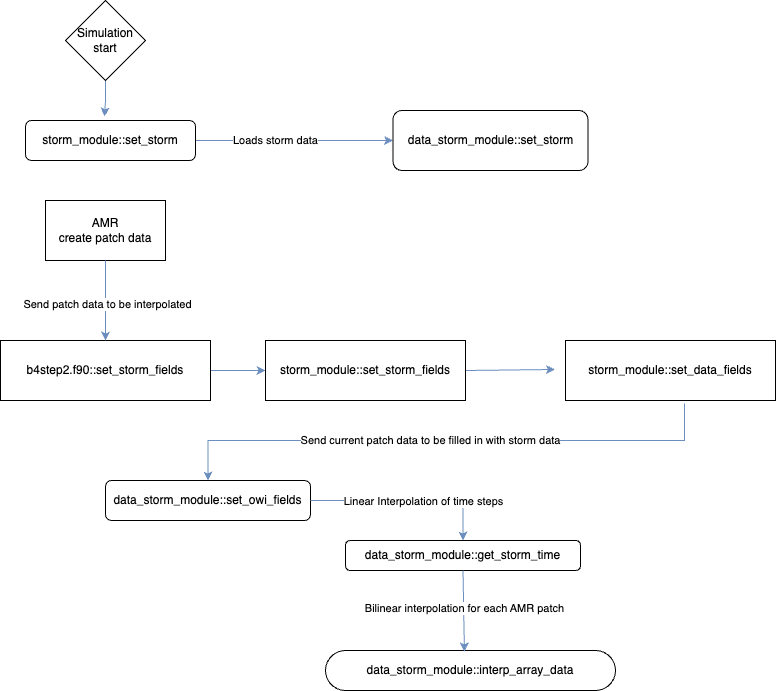

---
title: "Adapting data derived storm products for use in GeoClaw"
tags: 
    - Python
    - geophysics
    - hurricanes
    - fortran
    - storm surge
authors:
    - name: Catherine R. Jeffries
      orcid: 0000-0001-7900-372X
      corresponding: True
      affiliation: 1
    - name: Robert Weiss
      orcid: 
      affiliation: '1, 2'
    - name: Kyle Mandli
      orcid: 
      affiliation: 3
    - name: Tim Warburton
      affiliation: 4
affiliations:
    - name: Virginia Tech Department of Geosciences
      index: 1
    - name: Virginia Tech Center for Coastal Studies
      index: 2
    - name: "Flatiron Institute"
      index: 3
    - name: Virginia Tech Department of Mathematics
      index: 4
date: 1 January 2024
bibliography: ref.bib
---
# Summary
Storm surge is a complicated phenomenon that is generated by wind and pressure dynamics of a hurricane. Aside from storm wave, the storm surge is the major contributing factor to the devastating impact of a hurricane causing flooding, damage, and loss of life and habitat. Storm surge simulations significantly contribute to improving our understanding of storm dynamics and the resulting surge and their impacts along the coastlines. The wind and pressure data used as boundary conditions in hurricane models can be calculated in different ways; for example an algorithm that calculates the wind and pressure changes as a storm travels such as Holland (1980) [@Holland1980], or employing a planetary boundary layer model that generates the wind and pressure profiles from specific storm inputs. 

GeoClaw, a geophysical modeling software [@berger2011geoclaw; @mandli2014adaptive; @leveque1994clawpack; @clawpack], has the capability of calculating wind and pressure fields on demand with data inputs that are time series of the storm's characteristics using algorithms created from wind and pressure models like Holland 1980. To this point GeoClaw has not been able to utilize wind and pressure fields generated from planetary boundary layer models, directly. This paper describes the inclusion of these data derived wind and pressure fields into the GeoClaw model with specific applications for storm surge.

# Statement of need

GeoClaw has the capability of modeling storm surge dynamics but is limited in the type of input data it can read. Currently it can read data from Automated Tropical Cyclone Forecasting (ATCF) [@atcf], Hurricane Database (HURDAT2) [@landsea2015revised] and others. However, the ability to employ wind and pressure data that is formatted in gridded datasets did not exist. This functionality has been requested by the US army corps of engineers as well as others, as gridded wind and pressure data is available through the use of planetary boundary layer (PBL) models and additional models. These types of datasets are commonly used with Advanced Circulation Model (ADCIRC) [@westerink2008basin] a different storm modeling software. The advantage of GeoClaw over ADCIRC for the simulation of storm-surge dynamics is reduced computation time due to its adaptive mesh refinement which allows for increased resolution when and where it is needed which speeds up computation time.

In a storm surge study we wished to use hurricane forcing inputs created with a PBL model but GeoClaw was not configured to utilize this data. These inputs were formatted using a fortran fixed width format and provide arrays of the wind velocity in the x and y directions as well as a pressure arrays for the basin in which the storm makes landfall. These arrays are generated for individual time steps as the storm travels and changes. We added several routines to GeoClaw to enable the use of these arrays as inputs to the classical shallow water equations that generate the changes in the ocean's surface that is the storm surge. Firstly the read routine takes the data from file and reformats into a netcdf-4 compliant format. As part of the read/write process we calculate the maximum storm radius as defined as the last closed isobar of the pressure field. Additionally, we calculate the radius of maximum winds for the storm. 

The input arrays are limited in the refinement of the grids usually given a 0.25 degree spacing. Once the netcdf file is read into the fortran routines of GeoClaw we employ linear interpolation of the data to decrease the time steps between data inputs. This is performed because the model requires sub-minute time steps to accurate calculate the changes in sea surface height. Additionally the spatial coarseness of the grids requires bilinear interpolation to track the changes of the storm as it moves across the basin to areas of increased refinement such as the bay, island, or city at which we're interested in observing the storms response. \autoref{fig:flowchart} illustrates the call pattern of the storm loading and interpolation modules during a simulation.

# Examples
We provide a jupyter notebook that walks the user through the required input steps and how to start a simulation using the data derived functionality. Additionally we've generated an example hurricane to model to illustrate the accuracy of the new methodology. The code is hosted on GitHub under the owi branch of GeoClaw and will be pulled into the model as pull requests and feature issues are added

# References
